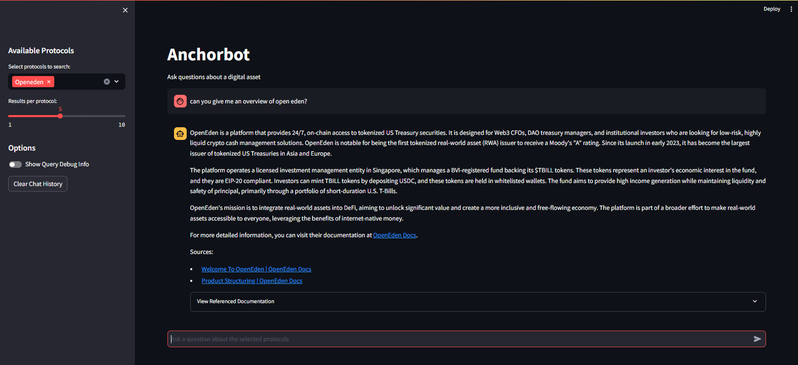

# Anchorbot

Anchorbot is the initial prototype of a digital asset chatbot for engineering teams at Anchorage Digital. It's purpose is to accelerate the adoption of various digital assets by decreasing required onboarding time for engineers starting work on a new digital asset and reducing the time-to-first-line-of-code (TTFLOC).

Streamlining the adoption of new digital assets allows Anchorage to serve it's client's quicker and eases the engineer onboarding process for existing digital assets.

## Features and Assets Onboarded
The tool is currently a chatbot interface where users can ask questions about the asset of their choice. The chatbot will supply answers along with references to the documentation the engineer can review themselves as well. 

The currently onboarded assets are GEL, OpenEden, and Orderly. The documentation for these assets has been downloaded and is used as context to answer the user's questions through RAG. 

## Setup
* clone the repo
* pip install the requirements 
    * `pip install -r requirements`
* Set your OpenAI key environment variable
    * `export OPENAI_API_KEY=<api key>`
    * or
    * `set OPENAI_API_KEY=<api key>`
* Run the streamlit application
    * `streamlit run anchorbot.py`

## Implementation Details
### Data Collection Process
The documentation was scraped with a headless scraper in *scrape_and_extract.py* and extracted to markdown files. These markdown files for each asset were then setup as different tables in a LanceDB vector database *docs_lancedb*.

### RAG Implementation
Each user query submitted to Anchorbot will follow the below high level flow:
* Query expansion
    * The user query will have several similar queries generated that attempt to capture different aspects of the semantic meaning of the original query along with keywords and technical terms. 
* Hybrid search (semantic and full-text) and reranking
    * The top k relevant documents will be retrieved from the vector db with each of the expanded queries along with the original query. 
    * Search is done using LanceDB's built in hybrid search and reranker
    * Top scored documents are returned to be used as context in generation

## Architecture Diagram

## Roadmap
The roadmap for future development for Anchorbot is here: [Roadmap](roadmap.md)